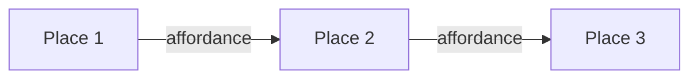

# Shape Up Plugin — Design

> Design spec produced via `/sc:design`. Reads alongside `REQUIREMENTS.md` (the what). This document is the how. No implementation code — that belongs to `/sc:implement`.

## Table of Contents

1. [Plugin Scaffold](#1-plugin-scaffold)
2. [Plugin Metadata (`plugin.json`)](#2-plugin-metadata-pluginjson)
3. [Plugin README](#3-plugin-readme)
4. [References — Shared Concept Library](#4-references--shared-concept-library)
5. [Project Config (Pitches-Root Override)](#5-project-config-pitches-root-override)
6. [`shapeup:shape` — SKILL.md Design](#6-shapeupshape--skillmd-design)
7. [Interaction Flow](#7-interaction-flow)
8. [Opinionated Rule Engine](#8-opinionated-rule-engine)
9. [Section Templates](#9-section-templates)
10. [`pitch.md` Generation](#10-pitchmd-generation)
11. [Reserved-Slot Stub Skills](#11-reserved-slot-stub-skills)
12. [File I/O Contract](#12-file-io-contract)
13. [Testing & Validation Plan](#13-testing--validation-plan)

---

## 1. Plugin Scaffold

Final on-disk layout:

```
shapeup-skill/
├── .claude-plugin/
│   └── plugin.json
├── README.md
├── REQUIREMENTS.md
├── DESIGN.md
├── skills/
│   ├── shape/
│   │   ├── SKILL.md
│   │   └── templates/
│   │       ├── pitch.md.tmpl
│   │       ├── problem.md.tmpl
│   │       ├── appetite.md.tmpl
│   │       ├── solution.md.tmpl
│   │       ├── rabbit-holes.md.tmpl
│   │       └── no-gos.md.tmpl
│   ├── bet/
│   │   └── SKILL.md            # stub
│   ├── hill-chart/
│   │   └── SKILL.md            # stub
│   ├── scope-hammer/
│   │   └── SKILL.md            # stub
│   ├── cycle-plan/
│   │   └── SKILL.md            # stub
│   └── retro/
│       └── SKILL.md            # stub
└── references/
    ├── shape-up-overview.md
    ├── pitches.md
    ├── appetite.md
    ├── breadboards.md
    ├── rabbit-holes.md
    ├── no-gos.md
    ├── circuit-breaker.md
    ├── hill-chart.md          # for future shapeup:hill-chart
    ├── betting-table.md       # for future shapeup:bet
    └── scope-hammering.md     # for future shapeup:scope-hammer
```

**Naming convention for templates:** `.md.tmpl` suffix keeps them from being confused with real pitch section files, and makes it obvious they're scaffolds the skill copies and fills in.

---

## 2. Plugin Metadata (`plugin.json`)

Located at `.claude-plugin/plugin.json`. Follows the Claude Code plugin schema (confirmed against the `career-certified` plugin in the local marketplace repo). Skills are **auto-discovered** from `skills/*/SKILL.md` — no skill list in this file.

```json
{
  "name": "shapeup",
  "description": "Shape Up methodology (Basecamp) as a family of opinionated Claude Code skills. Turns raw feature ideas into properly shaped pitches with enforced discipline.",
  "version": "0.1.0",
  "author": {
    "name": "<author name>",
    "url": "<repo url>"
  },
  "repository": "<repo url>",
  "license": "MIT",
  "keywords": ["shape-up", "basecamp", "product-development", "shaping", "pitch"]
}
```

**Why `shapeup` (not `shapeup-skill`) as the plugin name:** `name` becomes the invocation namespace (`shapeup:shape`). The repo can still be called `shapeup-skill`; the two don't need to match.

---

## 3. Plugin README

Lives at repo root. Minimum sections:

- **What** — 2-sentence summary of Shape Up + what this plugin does
- **Install** — `claude plugin add <repo url>` or equivalent
- **Skills in this family** — table with columns: skill, status (ready / planned), one-line purpose
- **Quickstart** — invoke `/shapeup:shape` to begin; short example interaction
- **Philosophy** — one paragraph on why it's opinionated (hard stops, not warnings)
- **Configuration** — how to override pitches root (see §5)
- **References** — link to https://basecamp.com/shapeup and to the `references/` directory

Keep to one screen. Longer docs go in `REQUIREMENTS.md` and `DESIGN.md`.

---

## 4. References — Shared Concept Library

Each file is a **short, single-concept explainer** (~150–400 words). Skills load them on demand via `Read`. They are the plugin's shared vocabulary — a skill that cites "the circuit-breaker principle" can tell the user "read `references/circuit-breaker.md` for context" rather than reinventing the explanation.

### Outline per file

| File | Purpose | Key content |
|---|---|---|
| `shape-up-overview.md` | One-page mental model | 6-week cycles + 2-week cool-down; shaping/betting/building; who does each |
| `pitches.md` | Anatomy of a pitch | The five sections, how they relate, what "shaped" means |
| `appetite.md` | The primary discipline | Small batch (1-2 wks) vs big batch (6 wks); appetite vs estimate; why time-boxed |
| `breadboards.md` | Fat-marker solutions | Places, affordances, connection lines; why not wireframes; mermaid rendering examples |
| `rabbit-holes.md` | Risk inventory | Common patterns (scope creep, tech unknowns, integration surprises); how to write them |
| `no-gos.md` | Explicit scope cuts | The discipline of "what we're NOT doing" and why it belongs in the pitch |
| `circuit-breaker.md` | Ship-or-drop | If it's not done in the cycle, it doesn't ship — why this matters |
| `hill-chart.md` | Build-phase tracking | (reserved for future) figuring-it-out uphill, making-it-happen downhill |
| `betting-table.md` | Cycle selection | (reserved for future) how senior folks bet on pitches |
| `scope-hammering.md` | Mid-cycle scope cutting | (reserved for future) the discipline of cutting, not extending |

### Writing style

- Lead with the definition
- One concrete example
- One anti-pattern ("what this is NOT")
- No filler; these are reference cards, not essays

---

## 5. Project Config (Pitches-Root Override)

Default: `./pitches/` at project root. Override via a project-level config file:

**File:** `./.shapeup.json` (project root)

```json
{
  "pitchesRoot": "docs/shape-up/pitches"
}
```

**Resolution logic in the skill:**
1. `Read ./.shapeup.json` — if exists and has `pitchesRoot`, use it.
2. Otherwise default to `./pitches/`.
3. Resolve paths relative to the project root (the directory containing `.shapeup.json`, or the current working directory if absent).

**Why not `CLAUDE.md` or `.claude/settings.json`:** a dedicated file keeps plugin config separate from Claude Code harness config and from project docs. It's also discoverable by other future tooling if the family grows.

---

## 6. `shapeup:shape` — SKILL.md Design

### Frontmatter

```yaml
---
name: shape
description: Use when the user wants to pitch, shape, or frame a new feature, initiative, or idea — including phrases like "I want to build X", "let's pitch Y", "new feature idea", "shape this up", "turn this into a pitch", or when they explicitly invoke /shapeup:shape. Produces a properly shaped Shape Up pitch (problem, appetite, solution, rabbit holes, no-gos) with enforced discipline — rejects vague appetites, solutioning in problems, over-detailed solutions, and empty rabbit-holes/no-gos sections.
---
```

**Description design rationale:**
- Front-loads trigger phrases so auto-invoke is reliable
- States the output shape (the five sections) so Claude knows what "done" looks like
- Names the opinionated discipline so Claude knows to push back rather than be helpful-but-shapeless

### Body — structural outline

The SKILL.md body is a behavioral spec, not code. Section order matters because Claude reads top-down.

```
# shapeup:shape — Shaping Assistant

## Role
One paragraph: you are an opinionated Shape Up shaping coach. You help the user turn raw
ideas into properly shaped pitches. You follow Basecamp's Shape Up discipline — appetite
first, fat-marker solutions, explicit rabbit holes and no-gos. You do not help the user
cheat the discipline; you hard-stop and offer concrete fixes when they violate it.

## First-turn protocol
1. Determine pitch slug:
   - If invoked with `/shapeup:shape <slug>` → use that slug.
   - Else → parse the user's message for an obvious slug candidate, or prompt.
2. Determine pitch root: Read `./.shapeup.json` (optional) or default `./pitches/`.
3. Check if `<pitches-root>/<slug>/` exists:
   - Exists → enter RESUMPTION MODE.
   - Does not exist → ask the triage question (§below), then enter NEW-PITCH MODE.

## Triage question (new pitches only)
Ask exactly: **"Do you have a rough draft already, or are we starting from scratch?"**
- "Starting from scratch" or similar → DIALOGUE MODE.
- "I have a draft/notes/something written" → DRAFT-CRITIQUE MODE.
- Ambiguous → ask once more with a concrete example of each.

## Dialogue mode
Walk through sections in order: problem → appetite → solution → rabbit-holes → no-gos.
For each section:
1. Prompt for content (see per-section prompts in §8).
2. Run the rule checks for that section (§8).
3. If violations → HARD STOP with fix guidance (§8). Do not advance.
4. If clean → write `<pitches-root>/<slug>/<section>.md`. Advance.
5. After the final section → regenerate `pitch.md` (§10). Announce "ready for betting."

## Draft-critique mode
1. Take the user's raw material.
2. Generate first-pass drafts for all five sections in memory.
3. Write each section file; then immediately run all rule checks.
4. For each violation → HARD STOP with fix guidance. Do not regenerate `pitch.md`.
5. Loop: user fixes → re-check → advance. Once all clean → regenerate `pitch.md`.

## Resumption mode
1. List existing files under `<pitches-root>/<slug>/`.
2. For each of the five sections, classify: MISSING / PRESENT-VALID / PRESENT-INVALID.
   Run the rule checks for each present file.
3. Report the state to the user ("you have problem.md and appetite.md; rabbit-holes.md
   is empty; no-gos.md is missing").
4. Resume at the first non-valid section using the relevant mode (dialogue by default).

## Hard-stop protocol
When any rule is violated:
1. State the violation name.
2. Quote the specific line/phrase that triggered it.
3. Cite the Shape Up principle (one sentence; link to `references/...` if relevant).
4. Offer 2–3 concrete fix suggestions as alternatives the user can pick from.
5. Do not proceed. Wait for user input.

## References
Load from the plugin's `references/` directory on demand:
- Appetite discussion → `appetite.md`
- Breadboard questions → `breadboards.md`
- Rabbit-hole coaching → `rabbit-holes.md`
- Shape Up philosophy questions → `shape-up-overview.md`
- Etc.
Do not inline long explanations; cite the reference file.

## Non-goals
- Not a project planner. No Gantt charts, sprint plans, or task breakdowns.
- Not a designer. Breadboards are place-affordance-connection sketches, not wireframes.
- Not a cheerleader. Don't soften the rules to be agreeable.
```

---

## 7. Interaction Flow

State machine, abstracted:

```
  ┌───────────────┐
  │   INVOKED     │
  └───────┬───────┘
          ▼
  ┌───────────────┐
  │ RESOLVE SLUG  │───(missing)───→ prompt user
  └───────┬───────┘
          ▼
  ┌───────────────┐
  │ DIR EXISTS?   │
  └───────┬───────┘
      yes │ no
  ┌───────┴────────┐
  ▼                ▼
[RESUMPTION]   [TRIAGE Q]
  │                │
  │          ┌─────┴──────┐
  │          ▼            ▼
  │      [DIALOGUE]   [DRAFT-CRITIQUE]
  │          │            │
  └──────────┴─────┬──────┘
                   ▼
          ┌─────────────────┐
          │ SECTION LOOP    │
          │ (apply rules)   │◄──┐
          └────────┬────────┘   │
                   ▼            │
              violation? ───yes─┘  (hard stop, wait for fix)
                   │no
                   ▼
          ┌─────────────────┐
          │ WRITE SECTION   │
          └────────┬────────┘
                   ▼
          ┌─────────────────┐
          │ MORE SECTIONS?  │──yes──→ back to SECTION LOOP
          └────────┬────────┘
                   │no
                   ▼
          ┌─────────────────┐
          │ REGEN pitch.md  │
          │ "ready for bet" │
          └─────────────────┘
```

### State carried between turns
**None.** All state lives on disk in `<pitches-root>/<slug>/`. Every invocation re-derives current state from files. This is what makes resumption work without conversation memory.

---

## 8. Opinionated Rule Engine

Each rule has: **ID**, **scope** (which section it checks), **detection signal**, **hard-stop message template**, **fix template**.

### R1 — Appetite Declared

- **Scope:** `appetite.md`
- **Detection:** file missing, empty, or none of these patterns match:
  - `small batch` (case-insensitive)
  - `big batch`
  - `[1-9]\s*(week|wk|day)s?`
- **Hard-stop:**
  > HARD STOP — R1: Appetite not declared.
  > Shape Up's primary discipline is **appetite, not estimate**. Every pitch must state how much time we're willing to spend before it gets cut or shipped.
  > See `references/appetite.md`.
- **Fixes:**
  1. Small batch (1-2 weeks) — focused problem, limited scope.
  2. Big batch (6 weeks) — meaningful bet, the standard Shape Up cycle.
  3. Non-standard (e.g., 3 weeks) — REQUIRES WRITTEN JUSTIFICATION in `appetite.md` (see R2).

### R2 — Non-Standard Appetite Requires Written Justification

- **Scope:** `appetite.md`
- **Detection:** stated appetite is not small batch (1–2 wks) or big batch (6 wks), AND `appetite.md` lacks a `## Justification` section with at least one sentence.
- **Hard-stop:**
  > HARD STOP — R2: Non-standard appetite "X weeks" needs a written justification.
  > The betting table needs to see the reasoning — a dismissible warning isn't enough.
- **Fixes:**
  1. Add a `## Justification` section explaining why small/big batch doesn't fit.
  2. Reconsider and pick small batch or big batch instead.

### R3 — No Solutioning in the Problem Statement

- **Scope:** `problem.md`
- **Detection (heuristics — Claude applies judgment):**
  - Phrases like "we need X", "we should build X", "add a Y", "create a Z"
  - Naming specific UI elements (dashboard, button, page) as *the problem*
- **Hard-stop:**
  > HARD STOP — R3: The problem statement is describing a solution.
  > Phrase flagged: "<quote>"
  > A problem is a situation someone is in; a solution is what we'd build. You've written a solution.
- **Fixes:**
  1. Rewrite as a concrete user scenario: who is doing what, hitting what friction?
  2. Include the raw customer quote or support ticket that prompted this.
  3. Ask "what's the pain that the solution you have in mind would relieve?" and state THAT.

### R4 — Problem Must Be Concrete

- **Scope:** `problem.md`
- **Detection (judgment-based):**
  - No raw quote, example, or specific scenario
  - Abstract language ("users want better analytics", "the system is slow")
  - No named actor, no named context
- **Hard-stop:**
  > HARD STOP — R4: Problem is stated abstractly.
  > Shape Up requires a **concrete situation** — a specific user, a specific moment, a specific friction. Abstract problems hide assumptions and produce shapeless solutions.
- **Fixes:**
  1. Paste a real customer quote or support ticket.
  2. Describe one specific scenario: "When Jane in the sales team tries to…"
  3. Describe a recent specific incident that motivated this.

### R5 — Solution Stays at Fat-Marker Level

- **Scope:** `solution.md`
- **Detection (judgment-based):**
  - Pixel-level details, specific colors, exact copy
  - Field-by-field form specifications
  - Specific API endpoint signatures or database schemas
  - Wireframe-grade mermaid diagrams (too many nodes, too much nesting)
- **Hard-stop:**
  > HARD STOP — R5: Solution is too detailed.
  > Fat-marker solutions are breadboards: places, affordances, connection lines. Wireframes and specs belong to the build phase, not shaping. Over-detailed solutions close off the building team's judgment.
  > See `references/breadboards.md`.
- **Fixes:**
  1. Replace the detail with a place/affordance-level description.
  2. Collapse the mermaid diagram to <8 nodes, labeled by function.
  3. Remove specific copy, colors, and field specs — describe *what goes there* at the category level.

### R6 — Rabbit Holes Section Is Mandatory

- **Scope:** `rabbit-holes.md`
- **Detection:** file missing, empty, or contains only "none" / "n/a" / "nothing" / "tbd"
- **Hard-stop:**
  > HARD STOP — R6: No rabbit holes identified.
  > Every non-trivial feature has places where the team could get stuck. Shaping means finding them in advance. If you truly see none, you probably haven't looked hard enough.
- **Fixes (prompt-style):**
  1. What's the part of this that's hardest to estimate?
  2. What would a senior engineer worry about on seeing this?
  3. What dependencies, integrations, or unknowns are in the way?

### R7 — No-Gos Section Is Mandatory

- **Scope:** `no-gos.md`
- **Detection:** file missing, empty, or contains only "none" / "n/a" / "nothing"
- **Hard-stop:**
  > HARD STOP — R7: No no-gos declared.
  > Shape Up requires explicit scope cuts. "Everything reasonable is in scope" is not a pitch — it's a project. Declare what you are **not** building.
- **Fixes (prompt-style):**
  1. What's the next-most-obvious thing someone might expect and assume we'd include?
  2. What adjacent feature is deliberately deferred?
  3. What edge cases are we NOT handling in this cycle?

### Rule application order

Dialogue mode applies rules for each section as the user writes it (natural gating). Draft-critique mode applies all rules after drafting; reports in **priority order R1 → R7**.

---

## 9. Section Templates

Templates live at `skills/shape/templates/*.md.tmpl`. The skill **copies** a template to `<pitches-root>/<slug>/<section>.md`, then fills it in (dialogue mode) or prompts the user to fill it (draft-critique mode).

### `problem.md.tmpl`

```markdown
# Problem

## Raw material
<!-- Paste the customer quote, support ticket, or observation that motivated this.
     No paraphrasing. If there is no raw material, this pitch is not ready for shaping. -->

## The specific situation
<!-- Who is doing what, in what context, hitting what friction?
     ONE concrete scenario, not an abstraction. Name the actor. -->

## Why now
<!-- What changed? What makes this worth shaping today, not last quarter? -->
```

### `appetite.md.tmpl`

```markdown
# Appetite

## Size
<!-- One of:
     - Small batch (1–2 weeks)
     - Big batch (6 weeks)
     - Non-standard (N weeks) — requires Justification section below -->

## Justification
<!-- REQUIRED if non-standard. Leave blank (or remove the heading) if small/big batch. -->
```

### `solution.md.tmpl`

```markdown
# Solution

## Fat-marker outline
<!-- Describe the solution at place/affordance level.
     Not wireframes. Not API specs. Not copy.
     What are the places the user moves between, and what can they do in each? -->

## Breadboard
<!-- Mermaid diagram — places, affordances, connections.
     Keep it to fewer than ~8 nodes. Labels by function, not copy. -->



## What's different afterward
<!-- In one sentence, what can the user do after this ships that they couldn't before? -->
```

### `rabbit-holes.md.tmpl`

```markdown
# Rabbit Holes

<!-- At least one entry required. "None" is not accepted — see R6. -->

## <Name of rabbit hole>
- **Risk:** <what could go wrong>
- **Mitigation:** <how we'll contain it, or how we'll know to cut>

## <Name of rabbit hole>
- **Risk:** ...
- **Mitigation:** ...
```

### `no-gos.md.tmpl`

```markdown
# No-Gos

<!-- Explicit scope cuts. At least one required — see R7. -->

- **<Thing we're NOT doing>** — <why, or what the expectation is>
- **<Thing we're NOT doing>** — ...
```

### `pitch.md.tmpl`

See §10 — this one is generated, not filled in by the user.

---

## 10. `pitch.md` Generation

`pitch.md` is the **human-shareable one-page artifact**. It is regenerated (from scratch, overwriting) every time all five sections pass rule checks. Users don't edit it directly — edits to any section trigger regeneration.

### Template

```markdown
# <Slug, title-cased>

> Shaped pitch — ready for the betting table.
> Generated: <ISO timestamp>

## Problem
<contents of problem.md, minus the heading>

## Appetite
<contents of appetite.md, minus the heading>

## Solution
<contents of solution.md, minus the heading — includes the mermaid block>

## Rabbit Holes
<contents of rabbit-holes.md, minus the heading>

## No-Gos
<contents of no-gos.md, minus the heading>

---

*Sections: [problem](./problem.md) · [appetite](./appetite.md) · [solution](./solution.md) · [rabbit-holes](./rabbit-holes.md) · [no-gos](./no-gos.md)*
```

**Regeneration rule:** regenerate `pitch.md` only when all five sections pass. Never regenerate a partial pitch — a partial shareable artifact is a Shape Up anti-pattern.

---

## 11. Reserved-Slot Stub Skills

Each reserved slot has a single `SKILL.md` file. Example for `bet`:

```yaml
---
name: bet
description: [PLANNED — NOT YET IMPLEMENTED] Betting-table facilitator. Will help review a slate of shaped pitches and decide which to bet on for the next 6-week cycle. Use `/shapeup:shape` today for shaping pitches.
---

# shapeup:bet — Planned

This skill is a reserved slot in the `shapeup` plugin family.

**Planned purpose:** review a slate of shaped pitches and facilitate the betting-table decision of which to bet on for the next 6-week cycle.

**Status:** not yet implemented.

For now:
- Use `shapeup:shape` to produce shaped pitches.
- See the plugin README for the family roadmap.
```

### Slots needed

| Slot | Planned description |
|---|---|
| `bet` | Betting-table facilitator for cycle selection |
| `hill-chart` | Build-phase progress tracking using hill-chart visualization |
| `scope-hammer` | Mid-cycle scope cutting and trade-off coaching |
| `cycle-plan` | 6-week cycle plan assembly (team, pitches, cool-down) |
| `retro` | Post-cycle retrospective on shipped/unshipped bets |

**Why each is a real file, not just an empty dir:** empty directories produce no auto-discovered skill. A stub SKILL.md makes the slot visible to users browsing available skills, and its description tells Claude not to auto-invoke it (the `[PLANNED — NOT YET IMPLEMENTED]` prefix signals that).

---

## 12. File I/O Contract

Every file the skill reads or writes, in one place.

| Path | Read / Write | By whom | When |
|---|---|---|---|
| `./.shapeup.json` | Read (optional) | skill | first turn, to resolve `pitchesRoot` |
| `<pitches-root>/<slug>/problem.md` | R/W | skill | dialogue step / draft output / rule check |
| `<pitches-root>/<slug>/appetite.md` | R/W | skill | same |
| `<pitches-root>/<slug>/solution.md` | R/W | skill | same |
| `<pitches-root>/<slug>/rabbit-holes.md` | R/W | skill | same |
| `<pitches-root>/<slug>/no-gos.md` | R/W | skill | same |
| `<pitches-root>/<slug>/pitch.md` | Write-only | skill | regenerated after all sections pass |
| `skills/shape/templates/*.md.tmpl` | Read | skill | when writing a new section file |
| `references/*.md` | Read | skill | on demand when coaching the user |

**Atomicity:** writes are one file at a time. If the skill is interrupted mid-session, the on-disk state is still coherent — each section file is either written cleanly or not written at all.

---

## 13. Testing & Validation Plan

Pre-implementation checklist to drive `/sc:implement`:

- [ ] `plugin.json` follows actual Claude Code schema (verified against `career-certified` plugin)
- [ ] `shapeup:shape` auto-invokes on at least 3 trigger phrases from §6 description
- [ ] `/shapeup:shape foo` with no existing dir creates `<pitches-root>/foo/` and begins triage
- [ ] Triage question produces different modes for "starting from scratch" vs "I have a draft"
- [ ] Each of R1–R7 hard-stops on a crafted bad input
- [ ] Each of R1–R7 passes a crafted good input
- [ ] Resumption: delete `no-gos.md` from a complete pitch and re-invoke → skill picks up at no-gos
- [ ] `pitch.md` is regenerated only after all 5 sections pass
- [ ] `pitch.md` is NOT regenerated mid-flow (partial pitch invariant)
- [ ] Stub skills return the "planned — not yet implemented" message when invoked
- [ ] `.shapeup.json` override with `pitchesRoot: "docs/pitches"` routes writes correctly
- [ ] References are loaded on demand, not inlined into the SKILL.md body

---

## Open items for `/sc:implement`

None blocking. A few small judgment calls during implementation:

1. **Slug auto-suggestion algorithm** — simple: lowercase, strip non-alphanumeric, join with `-`, truncate to 40 chars. Derive from first noun phrase of `problem.md`'s "specific situation" heading, or from the user's initial message.
2. **Mermaid render validation** — the skill can check basic syntax (balanced braces, valid node count) but should not block on renderer quirks. Fail-soft: if mermaid is syntactically malformed, coach the user, don't hard-stop.
3. **Wording of hard-stop messages** — the templates in §8 are close-to-final; minor polish during implementation is fine. Don't soften them.

## Next step

Run `/sc:implement` to build from this design.
