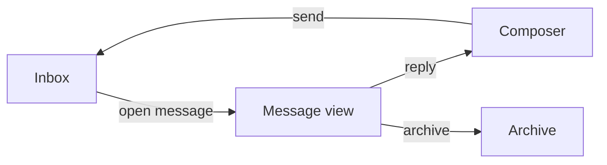
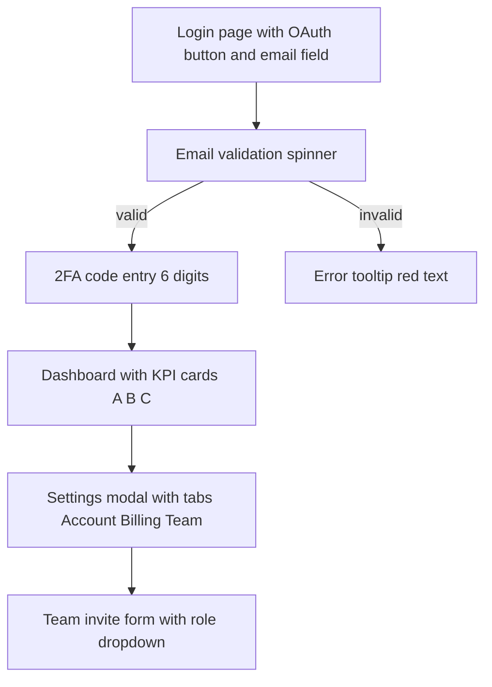

# Breadboards / Fat-Marker Solutions

Shape Up uses two visual languages during shaping: **breadboards** (for flow and affordances) and **fat-marker sketches** (for layout). This skill uses mermaid diagrams as stylized breadboards.

## What a breadboard captures

- **Places** — screens, views, states the user can be in.
- **Affordances** — actions available in each place (named generically, not labeled with specific UI copy).
- **Connections** — edges between places, labeled with the affordance that triggers the transition.

That's it. No layout. No typography. No color. No field-level detail.

## What a breadboard does NOT capture

- Wireframes (layout, grids, spacing).
- Copy (button labels, headings, placeholder text).
- Field specifications (types, validation rules).
- API endpoints or data shapes.
- Component structure (Navbar, Sidebar, Footer).

If any of those appear in your solution section, you're past shaping. Cut them back.

## Mermaid example (a reasonable breadboard)

Four places, four affordances, one cycle. Readable in five seconds. That's a fat-marker solution.

## Mermaid example (too detailed — don't do this)

This is a wireframe described in nodes. Twelve nodes, specific copy, field counts, UI elements. Cut it back to 4–5 nodes at the affordance level.

## The heuristic

If your breadboard has more than about 8 nodes, or if any node label names a UI element type (button, modal, card, tab), you've slipped into wireframing. Collapse and redraw.
